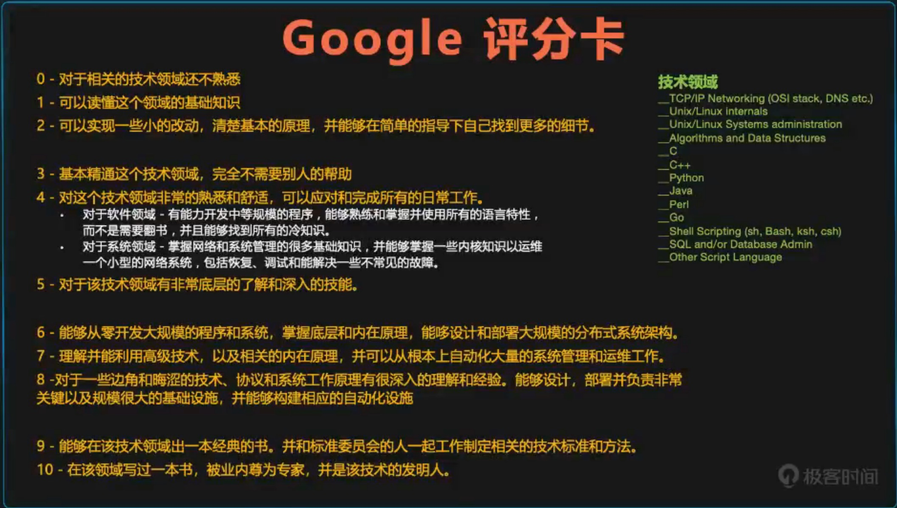

# 2020-02-22-程序员如何才能不迷茫

[toc]

## 一、前言

2020年2月22日晚上8点，[陈皓老师](https://coolshell.cn/)在极客平台上做了《谈怎么成长》的主题分享。本文简单记录一下直播的分享内容。

## 二、欲穷千里目，更上一层楼

### 2.1 焦虑产生的原因

随着年龄的增长，有焦虑是正常的，**关键在于如何面对焦虑**。

### 2.2 认识世界，趋势和自己

#### 2.2.1 这个世界是怎么组成的？

基础技术、工具、产品、项目……

> 极个别的人用基本技术制造出工具，然后成群的人一拥而上去使用这些工具。一部分人使用工具创造出产品，一部分人使用工具去解决问题，完成一个一个的项目。

大家的分工是怎么来的？

> 各行各业都是类似的，时间就像筛漏，一小部分人被筛出来去做有创造力的工具，大部分被分配去做体力工作。这其中的界线很难跨越。

#### 2.2.2 这个世界需要什么样的人？以及这些人的特点

- 劳工、技工、特种工、设计、架构、经理……

> 这个世界需要劳工，便体力；
>
> 这个世界需要技工，会用新技术解决问题；
>
> 这个世界需要特种工，具备过硬的综合能力；
>
> 设计是为了重用、好维护；
>
> 架构是为了稳定、重用、性能；
>
> 经理是项目进度、团队、文化

- Google评分卡

  

  工作五年后应该让自己达到第六个级别，这样就不会迷茫了。

#### 2.2.3 这个世界的技术趋势和规律是什么样的？

- 工业革命、信息革命

谷歌里流行一句话：过去十年发生过的事，未来一定会发生；过去没有发生过的事儿，未来可能会发生。

> 我的感悟：学习历史是很重要的，我们所处的这个国家（中国）是历史最悠久的国家，我们也应当好好了解自己国家的历史，从历史中吸取教训。

我们选择的计算机软件开发行业，历史时机、机会都是合适的，我们自己要留心在这个行业里做对的事情。

- 技术更新淘汰、风口是什么样的

## 三、勿在浮沙筑高台

### 3.1 学习基础知识的重要性

- 一通百通

  所有的技术原理和本质都是在基础技术上

- 突破瓶颈

  只有基础技术才能让你上升到更高的层次

  在技术的世界里，量变永远无法导致质变

- 自己推导

  掌握基础技术和以及原理可以让自己推导答案和趋势

### 3.2 有哪些基础知识

- 程序语言

  原理、编程范式、设计模式、代码设计、类库……

- 系统

  计算机原理、操作系统、网络协议、数据库……

- 中间件

  消息队列、缓存、网关、代理……

- 理论知识

  算法和数据结构、系统架构、分布式……

### 3.3 如何辨别有潜力的新技术

- 解决什么样的问题
  - 任何技术的出现都要解决已有的问题
  - 降低技术门槛、提高开发效率、提升稳定性……
- 提升了什么样的能力
  - 可以计算更为复杂的计算
  - 可以自动化更为复杂和更为困难的事
- 会成为主流技术的特征
  - 有大公司做背书
  - 有杀手级应用
  - 有强大的社区

## 四、事半功倍，巧干胜于蛮干

### 4.1 如何提升学习技能

- 学习是为了找到方法

  > 学习不是为了找答案，而是找到通向答案的方法。

- 学习为了认识原理和本质

  > 理解原理和本质就可以一通百通

- 学习是为了打开自己的认知

  > 你不知道你不知道的东西

- 学习是为了改善自己

  > 思维方式-更加严谨和科学
  >
  > 行动方式-更为高效

### 4.2 相关的学习技巧

- 挑选知识和信息源

  > 第一手资料非常重要（英文非常重要）

- 注意基础和原理

  > 我可以忘了这个技术，但是我可以徒手打造出来

- 使用知识图系统学习

  > 通过知识关联可以进行“顺藤摸瓜”。

  在脑海中呈现出知识图。

- 举一反三

  > 用不同的方法学习同一个东西。
  >
  > 学一个东西时把周边的也学会了。

- 总结和归纳

  > 形成框架、套路和方法论

- 实践和坚持

  > 实践才能把知识变成技能，坚持才能有沉淀。

### 4.3 主动学习和被动学习

实践、教会别人、讨论，是主动学习；听讲座、阅读、听音频、看演示，是被动学习。

**只要实践，就能掌握75%。**

> 知行合一很重要。

